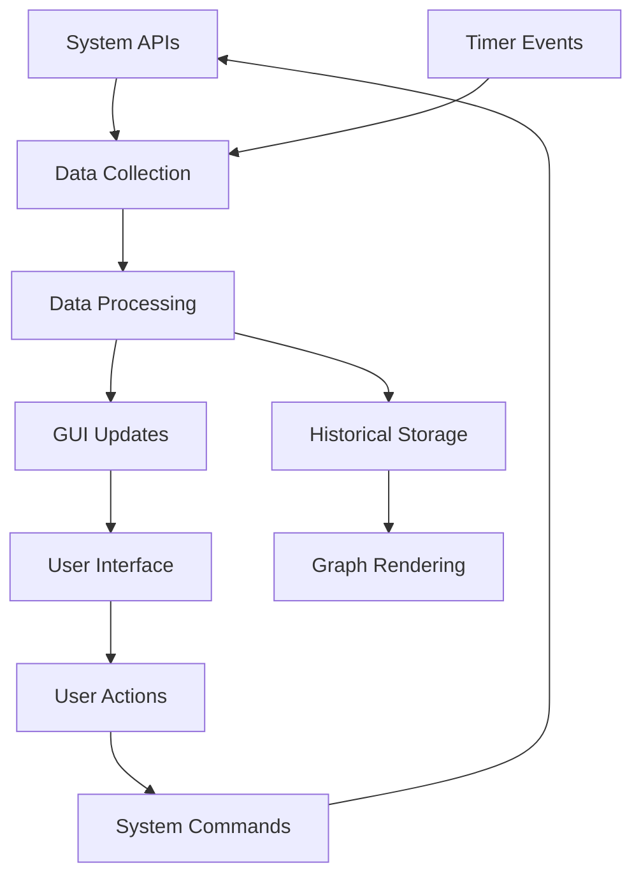

# OS_TASK_MANAGER-PROJECT
# System Monitor Project Report

**Project Name:** Kali Smart System & Study Assistant Manager  
**File:** temp.py  
**Date:** December 12, 2025  
**Language:** Python 3  
**Framework:** Tkinter GUI

---

## 📋 Executive Summary

This project is a comprehensive system monitoring and productivity assistant application designed for Kali Linux environments. It combines real-time system monitoring, security analysis, productivity tracking, and system management tools in a single dark-themed GUI interface.

---

## 🎯 Project Objectives

1. **Real-time System Monitoring**: Monitor CPU, RAM, disk usage, and network traffic
2. **Security Analysis**: Track failed login attempts and detect dangerous commands
3. **Productivity Tracking**: Analyze shell history for study/work patterns
4. **Process Management**: View and manage running processes
5. **Data Visualization**: Provide live performance graphs
6. **System Health Assessment**: Calculate overall system health scores
7. **Backup & Reporting**: Generate reports and backup project files

---

## 🏗️ Architecture Overview

```
┌─────────────────────────────────────────┐
│             GUI Layer (Tkinter)         │
├─────────────────────────────────────────┤
│          Data Processing Layer          │
├─────────────────────────────────────────┤
│        System Interface Layer           │
├─────────────────────────────────────────┤
│     OS APIs (psutil, subprocess)        │
└─────────────────────────────────────────┘
```

---

## 🔧 Technical Specifications

### **Dependencies**

- **Core Libraries**: `tkinter`, `ttk`, `psutil`
- **System Integration**: `os`, `subprocess`, `socket`
- **Data Structures**: `collections.deque`
- **File Operations**: `filedialog`, `messagebox`
- **Time Management**: `time`, `datetime`
- **Randomization**: `random`

### **Performance Characteristics**

- **Refresh Rate**: 1.5 seconds auto-refresh
- **Memory Usage**: Circular buffers (60 samples max)
- **CPU Monitoring**: 0.2-second intervals
- **Network Monitoring**: Real-time byte counting

### **Platform Compatibility**

- **Primary Target**: Kali Linux
- **Secondary Support**: Other Linux distributions
- **File System**: Unix-style paths (`/`, `~/.bash_history`)

---

## 🖥️ User Interface Design

### **Layout Structure**

```
┌─────────────────────────────────────────┐
│           System Status Panel           │
├─────────────────────────────────────────┤
│         Live Performance Graphs         │
├─────────────────────────────────────────┤
│          Process Manager Table          │
├─────────────────────────────────────────┤
│       Study & Security Assistant        │
├─────────────────────────────────────────┤
│            Action Buttons               │
└─────────────────────────────────────────┘
```

### **Color Scheme**

- **Background**: Dark theme (#111111, #202020)
- **Success Indicators**: Green (#00cc66)
- **Warning Indicators**: Orange (#ff9900)
- **Critical Indicators**: Red (#ff3333)
- **UI Elements**: Gray tones (#303030, #444444)

### **Visual Components**

1. **System Info Labels**: Real-time text displays
2. **Performance Graphs**: Line charts with grid backgrounds
3. **Process Table**: Sortable tree view with color coding
4. **Control Buttons**: Styled action buttons
5. **Status Panels**: Information displays with color coding

---

## 📊 Feature Analysis

### **Core Features**

| Feature             | Implementation             | Status      |
| ------------------- | -------------------------- | ----------- |
| CPU Monitoring      | `psutil.cpu_percent()`     | ✅ Complete |
| RAM Monitoring      | `psutil.virtual_memory()`  | ✅ Complete |
| Disk Usage          | `psutil.disk_usage()`      | ✅ Complete |
| Network Traffic     | `psutil.net_io_counters()` | ✅ Complete |
| Process Management  | `psutil.process_iter()`    | ✅ Complete |
| Security Analysis   | Log file parsing           | ✅ Complete |
| Graph Visualization | Canvas drawing             | ✅ Complete |
| Report Generation   | File export                | ✅ Complete |

### **Advanced Features**

| Feature         | Description                 | Implementation            |
| --------------- | --------------------------- | ------------------------- |
| Health Scoring  | System performance rating   | Mathematical algorithm    |
| Safety Checking | Dangerous command detection | Pattern matching          |
| Study Tracking  | Shell history analysis      | File parsing + statistics |
| Auto-refresh    | Live data updates           | Timer-based callbacks     |
| Data Export     | System reports              | File dialog + formatting  |
| Project Backup  | Compressed archives         | tar.gz creation           |

---

## 🛡️ Security Features

### **Security Monitoring**

1. **Failed Login Detection**

   - Monitors `/var/log/auth.log`
   - Fallback to `journalctl` commands
   - Counts authentication failures

2. **Dangerous Command Detection**

   - Scans shell history for risky commands
   - Pattern matching for destructive operations
   - Monitors recent command history (80 commands)

3. **System Health Assessment**
   - Combines performance and security metrics
   - Penalty system for high resource usage
   - Security incident impact on health score

### **Dangerous Command Patterns**

```python
dangerous_keywords = [
    "rm -rf /",           # System deletion
    "mkfs",               # Filesystem formatting
    ":(){ :|:& };:",      # Fork bomb
    "chmod 777",          # Insecure permissions
    "dd if=",             # Disk operations
]
```

---

## 📈 Performance Monitoring

### **Real-time Metrics**

- **CPU Usage**: Percentage utilization with 0.2s sampling
- **Memory Usage**: Physical RAM consumption tracking
- **Disk Space**: Available storage monitoring
- **Network Traffic**: Upload/download rates in KB/s
- **Process Activity**: Individual process resource consumption

### **Historical Data**

- **Buffer Size**: 60 samples (approximately 90 seconds)
- **Data Structure**: Circular buffers using `collections.deque`
- **Visualization**: Real-time line graphs with grid overlays

### **Color-coded Alerts**

```python
def _color_for_usage(value):
    if value < 50:   return "#00cc66"    # Green: Safe
    elif value < 80: return "#ff9900"    # Orange: Warning
    else:            return "#ff3333"    # Red: Critical
```

---

## 🔄 Data Flow Architecture



### **Update Cycle**

1. **Timer Trigger** (1.5s intervals)
2. **Data Collection** (system metrics)
3. **Processing** (calculations, formatting)
4. **GUI Update** (labels, graphs, tables)
5. **User Interaction** (button clicks, selections)
6. **Action Execution** (system commands)

---

## 🐛 Current Issues & Limitations

### **Critical Issues**

1. **Line 651**: `if __name__ == "main":` should be `"__main__"`
2. **Line 128**: `def init(self):` should be `def __init__(self):`
3. **Line 129**: `super().init()` should be `super().__init__()`

### **Missing Imports**

```python
# Required imports not present in file
import os
import socket
import subprocess
import datetime
import time
import random
import tkinter as tk
import psutil
```

### **Platform Dependencies**

- **Linux-specific paths**: `/var/log/auth.log`, `~/.bash_history`
- **Unix commands**: `tar`, `journalctl`, `grep`
- **Shell assumptions**: bash/zsh history formats

### **Error Handling**

- Basic exception handling present
- Could benefit from more specific error types
- Network connectivity assumptions for IP detection

---

## 🔧 Recommendations

### **Immediate Fixes**

1. Correct constructor method names
2. Add missing import statements
3. Fix main execution guard
4. Add cross-platform path handling

### **Enhancements**

1. **Configuration File**: Settings persistence
2. **Plugin System**: Modular feature additions
3. **Database Storage**: Historical data persistence
4. **Web Interface**: Remote monitoring capabilities
5. **Alerting System**: Email/notification alerts
6. **Multi-user Support**: User-specific tracking

### **Code Quality**

1. Add comprehensive docstrings
2. Implement unit tests
3. Add type hints for better IDE support
4. Refactor large methods into smaller functions

---

## 📚 Educational Value

### **Learning Outcomes**

1. **GUI Development**: Tkinter mastery, layout management
2. **System Programming**: OS interaction, process management
3. **Data Visualization**: Real-time graphing, canvas operations
4. **Security Awareness**: Log analysis, threat detection
5. **Performance Monitoring**: Resource usage tracking

### **Skill Development**

- **Python Programming**: Advanced language features
- **System Administration**: Linux system monitoring
- **Security Analysis**: Log parsing, threat detection
- **UI/UX Design**: Dark theme implementation
- **Data Management**: Circular buffers, real-time processing

---

## 🎯 Conclusion

This System Monitor project represents a sophisticated approach to system administration and monitoring. It successfully combines multiple domains - system monitoring, security analysis, and productivity tracking - into a cohesive application.

**Strengths:**

- Comprehensive feature set
- Real-time data visualization
- Security-focused design
- User-friendly interface
- Educational value for system administration

**Areas for Improvement:**

- Code organization and documentation
- Error handling and robustness
- Cross-platform compatibility
- Performance optimization
- Feature extensibility

The project demonstrates advanced Python programming concepts and provides practical value for system administrators and security professionals working with Linux environments.

---

## 📝 Technical Documentation

### **File Structure**

```
temp.py
├── Helper Functions (Lines 1-125)
├── GUI Class Definition (Lines 127-651)
├── System Info Components (Lines 160-175)
├── Performance Graphs (Lines 177-191)
├── Process Management (Lines 193-219)
├── Security Panels (Lines 221-248)
├── Action Handlers (Lines 475-651)
└── Main Execution (Line 651)
```

### **Code Metrics**

- **Total Lines**: ~651
- **Functions**: ~15 helper functions
- **Methods**: ~15 class methods
- **Classes**: 1 main class (TaskStudyManager)
- **GUI Components**: ~20 widgets
- **Complexity**: Medium-High

This report provides a comprehensive overview of the system monitoring application, highlighting its features, architecture, and potential improvements.
